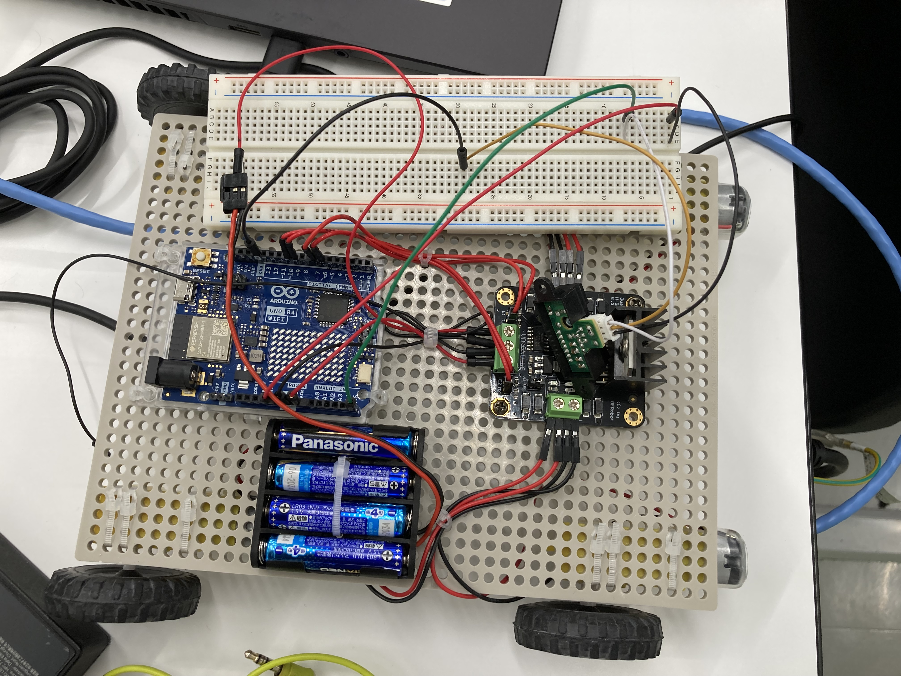

# RC-car

## 仕様

* 使用ハード：Arduino UNO R4 WiFi 
* 開発環境：Arduino IDE 
* 使用言語：C++ 
* 操作方法：UDPを用いた無線通信による制御 
* 搭載モジュール：赤外線センサ*1、(カメラ)*2 

*1：前方に障害物を検知した場合停止するために搭載。 
*2：スマートフォンを使用したライブ配信用カメラ。Arduinoとは接続していない。 

## 画像資料
RC-carの写真

赤外線センサーの作動実験の様子
<video controls src="etc/test_sensor.mp4"></video>
動画が読み込めない方は、お手数ですが下記のYoutube動画から閲覧ください。 
https://www.youtube.com/watch?v=9IW0eQ3qFIM

